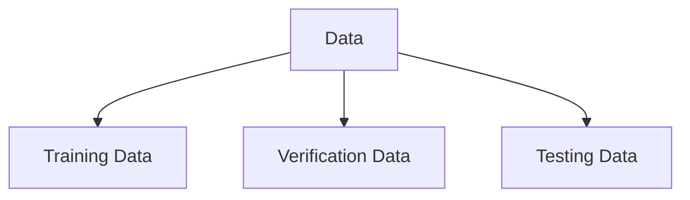

# Data Preprocessing

The most important libraries that will be used for **simple** Machine Learning Algorithms
- `pandas` to manipulate `csv` and `dataframes` that contain data
- `sklearn` for simple models

```python
import sklearn
import pandas as pd
```

Read the `you_data.csv` and print the first few rows to check the data

```python
my_dataframe = pd.read_csv("my_data.csv")
print(my_datafram.head())
```

## Data Processing

Print the number of missing data in each column for every row of data

```python
print(my_dataframe.isnull().sum())
```

> The data must not be biased, i.e. it should be balanced with respect to the number of output scenarios - check below for howto

Check for unbalanced data, should have approximately equal number of entries for all possible outputs

```python
my_dataframe["output_column"].value_counts() 
```

Remove any unnecessary data 

```python
my_dataframe = my_dataframe[my_dataframe["output_column"]  != "unwanted_row_value"]
```

Sort the values and remove any duplicated data

```python
my_dataframe.sort_values("output_column", <axis_value>, <ascending>, <inplace>)

# Get data by indices
indices_out = my_dataframe.iloc[from:to]

# Remove duplicates
my_dataframe.drop_duplicates(inplace)

# Merge data
merged_frames = [my_datafram_1, my_datafram_2]

# Use frac to jumble the data around
my_dataframe = pd.concat(merged_frames).sample(frac=1)
```

> Data at this point might have to be split and then merged in certain cases to ensure that we remove appropriate number of records from each case to make the data balanced, which ensures that the model is not biased

## Data Splitting

Split the data into 3 major parts



```python
from  sklearn.model_selection import train_test_split

# Capital because that is a matrix -> Input Matrix
X = my_dataframe.drop("output_column", axis=1) 

# Lowercase since the data is an array -> Output Array
y = final_df["output_column"] 
```


Better to split the data in 70:20:10 ratio as Training, Verification and Testing Data

```python
X_train, X_test, y_train, y_test = train_test_split(X, y, test_size = 0.1)
X_train, X_veri, y_tain, y_veri = train_test_split(X_train, y_train, test_size=0.2)  

print(X_train.shape, X_test.shape, X_veri.shape, y_train.shape, y_test.shape, y_veri.shape)
```

The output should match: 
$$
\begin{align}
&(\approx 70\% \times data , <\# vars>) &&(\approx 10\% \times data , <\# vars>) &&&(\approx 20\% \times data , <\# vars>) \\ &(\approx 70\% \times data,) &&(\approx 10\% \times data,) &&&(\approx 20\% \times data,) \\
\end{align}$$
 
