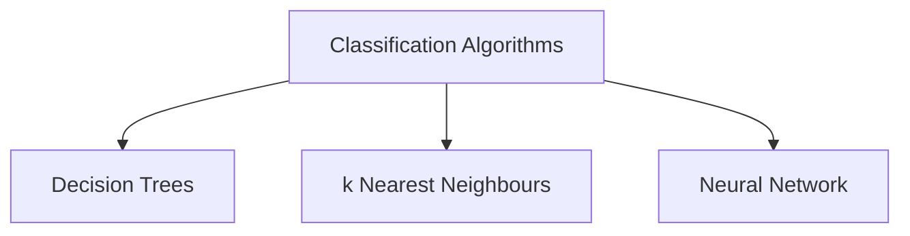

# FPGA for Machine Learning

- Any ML Program uses one of the above algorithm.
- These Algorithms can be run on CPU or a specialized hardware,
	- On a CPU, every instruction must be processed sequentially using generalized hardware, which requires a lot of time
	- On a logical circuit (hardware), it would be faster, as the processing is replaced by simple logical circuits on specialized hardware, that can run simultaneously.
- The special hardware can be pre designed or dynamically built on FPGA which makes it application specific.

---

## Decision Trees
- Decision tree is a hierarchical model that can be implemented using `switch` or `if` conditions
- Decision trees can be easily implemented using multiplexer, a logic circuit, which reduces code, and increases the speed.

## $k$ Nearest Neighbors
- For classification this k Nearest Neighbors algorithm is used.
- The nearest neighbors are decided based on certain parameters like Euclidian Space, or City block
	- Calculating these distance, would require mathematical operations, which can be quickened using an adder / subtractor and other mathematical calculators on FPGA.
	
## Neural Networks

- Depend on this $Y = w^t x + b$
- Where $W'$ is the transpose weight matrix that is multiplied with the input vector $x$ which can be handled by the FPGA for faster matrix multiplication
- Once again this should be added with the bias $b$, which can be done on FPGA for faster computation.

